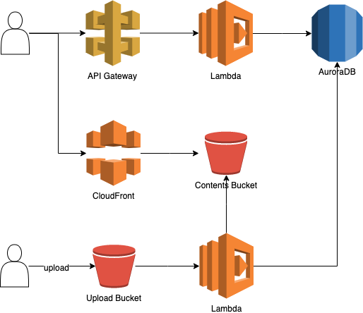

# serverless-node

## 환경설정

1. AWS
   * aws 계정
   * [aws-cli](./etc/aws-cli.md)
2. Node.js
   * version: v10.x
   * [nvm 설치 및 node version 관리](./etc/nvm.md)
3. Serverless Framework - AWS SAM
   * Serverless Application을 build하고 deploy하는 개발 tool
4. Docker
   * lambda와 같은 build환경을 구성하기 위해 사용

## 목차

* [step1](./step1.md): 전체 구성 설명, serverless 구성
* [step2](./step2.md): node express server, s3 create event trigger
* [step3](./step3.md): cloudfront 구성 - s3 create event trigger
