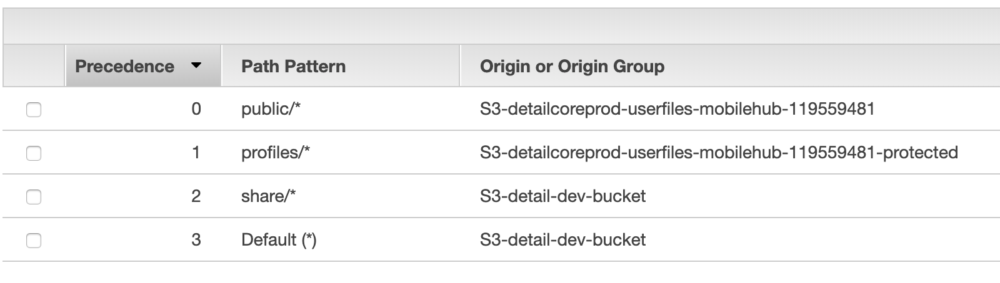

# cloudfront

## edge location

* AWS에서 CloudFront의 cache 서버
* [CloudFront](https://aws.amazon.com/ko/cloudfront/features/?nc=sn&loc=2)

## origin

* 배포를 생성할 때 CloudFront가 엣지 로케이션에 배포할 파일에 대한 요청을 보내는 위치를 지정합니다.

## cache behavior

* 캐시 동작은 웹 사이트에 있는 파일의 지정된 URL 경로 패턴에 대해 다양한 CloudFront 기능을 구성할 수 있도록 합니다.

* [cache 설정](https://docs.aws.amazon.com/ko_kr/AmazonCloudFront/latest/DeveloperGuide/Expiration.html)

## OAI(Origin Access Identity)

* OAI를 사용하여 S3 버킷에 대한 직접 URL을 사용하여 파일에 액세스할 수 없도록 권한을 구성한다.

## lambd@edge

